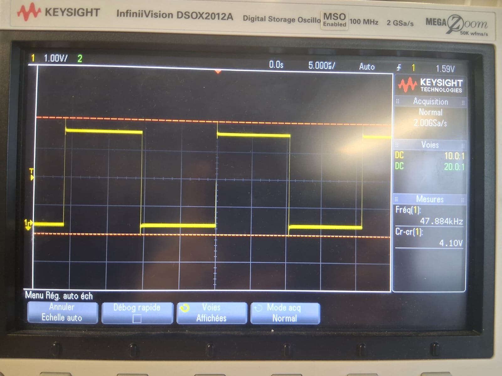
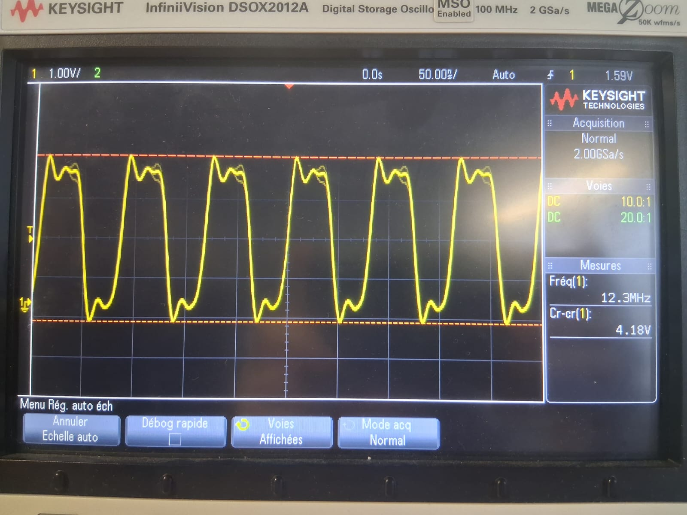
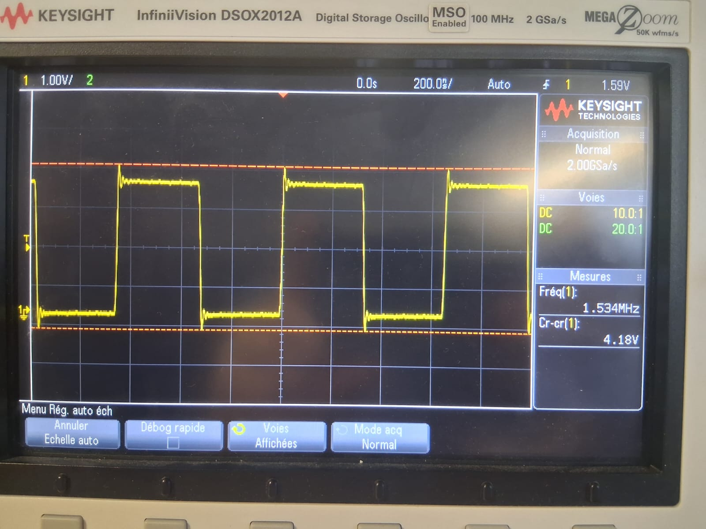
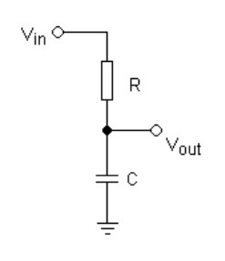

# TP_autoradio

## Démarrage

Dans un premier temps, on suit les étapes de démarrage du projet. On teste les différents périphériques (LEDs, USART2, printf), et on fait en sorte que notre shell fonctionne.

## Configuration matérielle

### GPIO Expander

- **Composant** : MCP23S17-E/SO
- **Datasheet** : disponible dans le dossier `datasheet/`

### SPI

- **Bus SPI utilisé** : SPI3 (sur la STM32)

Pour faire fonctionner le GPIO Expander, on configure le SPI en **"Full-Duplex Master"**. On met une **Data Size** de **8 bits**, puis on change le **PSC** à **32** afin d'avoir un **baudrate** de **2.5Mb/s**.


## Tests

Avant de passer au SGTL5000, on réalise le **driver** pour les leds, ainsi que des **commandes** qu'on appelle avec le shell, avec lesquels on commande l'état de chaque LED indépendant des autres.   
**Toutes ces étapes ont été vérifiées en classe par le professeur.**

## SGTL5000

On suit les étapes de configuration de l'I2C, du SAI, puis du DMA.
### I2C

- **Pins utilisées** : PB10 et PB11
- **Bus I2C** : I2C2

### TRAM DOUT

- **Interface de communication** pour la transmission de données
- Permet la sortie de données numériques vers les dispositifs externes


### Signaux d'horloge

On peut observer les **différents signaux d'horloge**, avec leurs **fréquences associées**. Ce sont les fréquences demandées, ce qui atteste d'une bonne configuration.







On génère ensuite un **signal triangle** avec succès.

### Signal triangulaire


Pour la suite du TP, nous avions une carte sans micro, puis nous n'avions pas de carte pendant les vacances. Donc pour la suite, nous allons expliquer comment nous aurions fait les différentes parties du TP.
### Bypass numérique

Pour le bypass numérique, nous recopierions le signal d'entrée vers la sortie sans aucune modification et que SGTL5000_CHIP_ANA_CTRL soit bien configuré pour prendre en entrée le microphone.

```c
void Audio_Bypass_Copy(uint32_t offset, uint32_t size)
{
    memcpy(&tx_buffer[offset], &rx_buffer[offset], size);
}

/* Callback DMA RX Half */
void HAL_SAI_RxHalfCpltCallback(SAI_HandleTypeDef *hsai)
{
    if (hsai == &hsai_BlockB2)
    {
        Audio_Bypass_Copy(0, AUDIO_BUFFER_SIZE / 2);
    }
}

/* Callback DMA RX Complete */
void HAL_SAI_RxCpltCallback(SAI_HandleTypeDef *hsai)
{
    if (hsai == &hsai_BlockB2)
    {
        Audio_Bypass_Copy(AUDIO_BUFFER_SIZE / 2, AUDIO_BUFFER_SIZE / 2);
    }
}
```

### VU Meter

Pour le VU Meter, nous calculerions le niveau RMS du signal audio entrant et mettrions à jour les LEDs.

On réalise une fonction pour update les leds:
```c
void VU_UpdateLEDs(uint8_t level)
{
    // Clamp
    if (level > VU_MAX_LEDS)
        level = VU_MAX_LEDS;

    // Éteindre toutes les LEDs
    for (uint8_t i = 0; i < 16; i++)
        MCP23S17_ClearLed(i);

    // Allumer les LEDs correspondantes
    for (uint8_t i = 0; i < level; i++)
    {
        MCP23S17_SetLed(i);         // Rangée 1 : 0 → 7
        MCP23S17_SetLed(i + 8);     // Rangée 2 : 8 → 15
    }
}
```

Calcul du niveau RMS:
```c
#define VU_MAX_LEDS     8
#define VU_MAX_LEVEL   20000   // à ajuster selon le gain micro

static uint8_t vu_level = 0;
static uint32_t vu_accumulator = 0;
static uint32_t vu_samples = 0;

void VU_ProcessAudio(uint32_t offset, uint32_t size)
{
    int16_t *samples = (int16_t *)&rx_buffer[offset];
    uint32_t count = size / 2; // nombre de samples 16 bits

    for (uint32_t i = 0; i < count; i += 2) // stéréo
    {
        int16_t sample = samples[i]; // canal gauche (micro)
        vu_accumulator += abs(sample);
        vu_samples++;
    }

    // Mise à jour toutes les ~10 ms
    if (vu_samples >= 480)
    {
        uint32_t avg = vu_accumulator / vu_samples;

        vu_level = (avg * VU_MAX_LEDS) / VU_MAX_LEVEL;

        VU_UpdateLEDs(vu_level);

        vu_accumulator = 0;
        vu_samples = 0;
    }
}
```

Et on appelle cette fonction dans les callbacks DMA RX:
```c
/* Callback DMA RX Half */
void HAL_SAI_RxHalfCpltCallback(SAI_HandleTypeDef *hsai)
{
    if (hsai == &hsai_BlockB2)
    {
        VU_ProcessAudio(0, AUDIO_BUFFER_SIZE / 2);
        Audio_Bypass_Copy(0, AUDIO_BUFFER_SIZE / 2);
    }
}
/* Callback DMA RX Complete */
void HAL_SAI_RxCpltCallback(SAI_HandleTypeDef *hsai)    
{
    if (hsai == &hsai_BlockB2)
    {
        Audio_Bypass_Copy(AUDIO_BUFFER_SIZE / 2, AUDIO_BUFFER_SIZE / 2);
        VU_ProcessAudio(AUDIO_BUFFER_SIZE / 2, AUDIO_BUFFER_SIZE / 2);
    }
}
``` 

### Filtre passe-bas



On implemente le filtre RC ci-dessus, on obtient l'équation différentielle suivante :

$$
V_{in}(t) = RC \, \frac{dV_{out}(t)}{dt} + V_{out}(t)
$$

On discrétise cette équation en utilisant la méthode d'Euler avant pour obtenir :

$$
V_{out}[n] = V_{out}[n-1] + \frac{T}{RC} (V_{in}[n] - V_{out}[n-1])
$$
avec \( T \) la période d'échantillonnage.

On implémente cette équation dans une fonction de traitement audio :

```c
#define SAMPLE_RATE 48000.0f
#define FC          2000.0f   // fréquence de coupure (Hz)
#define RC   (1.0f / (2.0f * 3.1415926f * FC))
#define TS   (1.0f / SAMPLE_RATE)
#define ALPHA (TS / (RC + TS))
static float y_prev = 0.0f;

static inline int16_t RC_LowPass_Filter(int16_t input)
{
    float x = (float)input;
    float y = ALPHA * x + (1.0f - ALPHA) * y_prev;

    y_prev = y;

    // Saturation 16 bits
    if (y > 32767.0f) y = 32767.0f;
    if (y < -32768.0f) y = -32768.0f;

    return (int16_t)y;
}

void Audio_Filter_Process(uint32_t offset, uint32_t size)
{
    int16_t *rx = (int16_t *)&rx_buffer[offset];
    int16_t *tx = (int16_t *)&tx_buffer[offset];

    uint32_t samples = size / 2; // samples 16 bits

    for (uint32_t i = 0; i < samples; i += 2) // stéréo
    {
        int16_t mic = rx[i];           // canal gauche
        int16_t y   = RC_LowPass_Filter(mic);

        tx[i]     = y; // gauche
        tx[i + 1] = y; // droite (mono → stéréo)
    }
}
```

Et on appelle cette fonction dans les callbacks DMA RX:
```c
/* Callback DMA RX Half */
void HAL_SAI_RxHalfCpltCallback(SAI_HandleTypeDef *hsai)
{
    if (hsai == &hsai_BlockB2)
    {
        VU_ProcessAudio(0, AUDIO_BUFFER_SIZE / 2);
        Audio_Bypass_Copy(0, AUDIO_BUFFER_SIZE / 2);
        Audio_Filter_Process(0, AUDIO_BUFFER_SIZE / 2);
    }
}
/* Callback DMA RX Complete */
void HAL_SAI_RxCpltCallback(SAI_HandleTypeDef *hsai)    
{
    if (hsai == &hsai_BlockB2)
    {
        Audio_Bypass_Copy(AUDIO_BUFFER_SIZE / 2, AUDIO_BUFFER_SIZE / 2);
        VU_ProcessAudio(AUDIO_BUFFER_SIZE / 2, AUDIO_BUFFER_SIZE / 2);
        Audio_Filter_Process(AUDIO_BUFFER_SIZE / 2, AUDIO_BUFFER_SIZE / 2);
    }
}
```
=======

